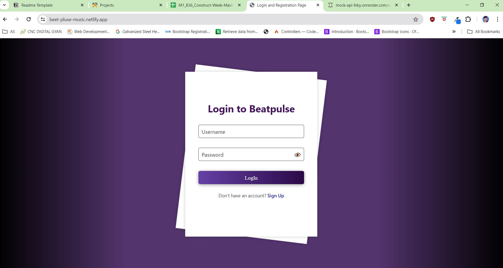

# SAP-Sultans_056
# Project Title
    beet-pulse-music

## Introduction
Embarking on a mission to revolutionize the music streaming landscape, our team has set out to develop a cutting-edge, open-source</br>
music streaming application. Leveraging our collective passion for music and technology, we aim to deliver a personalized and immersive </br>listening experience that rivals industry giants like YouTube and Spotify. Our platform will prioritize user engagement through 
</br>innovative features such as dynamic search, customizable playlists, and a detailed music player, all while ensuring robust 
</br>performance and user-friendly design. With a strong focus on state management, data persistence, and responsive UI, we are excited </br>to showcase our skills and create a unique space for music lovers worldwide.

 
## Project Type
Frontend 

## Deplolyed App
Frontend: https://www.netlify.com/ </br>
Backend: https://render.com/ </br>
Database: [Json server](https://mock-api-fxby.onrender.com/)

## Directory Structure
<pre>SAP-SULTANS_056/
├─ Admin/
|   ├─admin.css
|    ├─admin.html
|    ├─admin.js
|    ├─prostyle.css
|    ├─style.css
|    ├─user.css
|    ├─user.html
├─ Assets/
│  ├─web_logo.png 
|
├─index.css
├─index.html
├─login.css
├─Login.js
├─main.html
├─main.js
├─navbar.css
├─navbar.js
</pre>

## Video Walkthrough of the project
Attach a very short video walkthough of all of the features [ 1 - 3 minutes ]

## Video Walkthrough of the codebase
Attach a very short video walkthough of codebase [ 1 - 5 minutes ]

## Features
List out the key features of your application.

- Dynamic Search and Sorting : Implement a dynamic search using binary search and sort the song list using quicksort.
- Detailed Music Player : Develop a detailed music player with play, pause, next, previous, and loop functionalities, using circular linked lists for looping playlists.
- Performance Optimization : Optimize the platform’s performance using debouncing for search inputs, throttling for scroll events, and loaders for enhanced user experience.

## design decisions or Screenshots
     

## Installation & Getting started
```bash
-git clone https://github.com/alfaj7/SAP-Sultans_056.git
npm install
cd SAP-Sultans_056
```
open with live server 

## Usage
<!-- User Side -->
-SignUp: firstly user will create account
-LogIn : you need to Login by correct user name and password
-Landing page : here you can see all song and searching functionality you can play song manually or search for your favorite song
-Master Player: here you have option to play songs randomly or you sequence wise.
-Logout : redirect to LogIn.

<!-- Admin Side -->
-LogIn : you need to Login by correct user name and password //here we are provided hard coded username ans pass(admin, admin).
-Dashboard : here Admin can see all song list.
-User : here Admin will see all users.
-Add songs : Admin will able to add songs delete song edit song
-Logout : redirect to LogIn.
```bash
# Example
```

Include screenshots as necessary.

## Credentials
    User LogIn: 
    UserName: Modi ji
    Password: 1234

    Admin LogIn: 
    UserName: admin
    Password: admin
## APIs Used
    Users: https://mock-api-fxby.onrender.com/users
    Songs: https://mock-api-fxby.onrender.com/songs


## Technology Stack

- HTML
- CSS
- JAVASCRIPT
- RENDER.COM
- JSON SERVER
- GITHUB
- BOX-ICONS